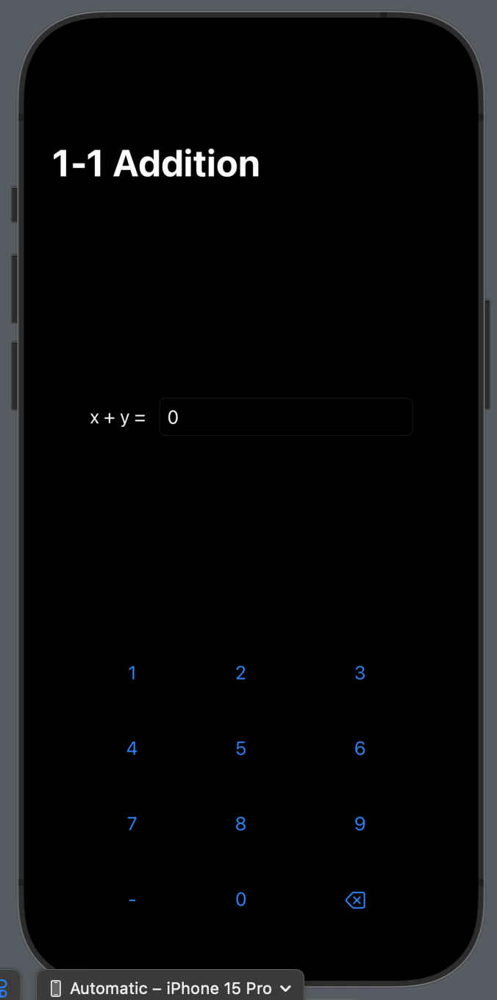

# quicklearn

an app to help me pratice math and science, especially mental math! i learned most of my calc from khan academy and it was very effective when i did the practices over and over again (because i couldnt just **not** bet 100%). this app strives to emulate this way of gaining skill through repatiton.

to run: download xcode, clone this pronect, open it, and run the preview!
